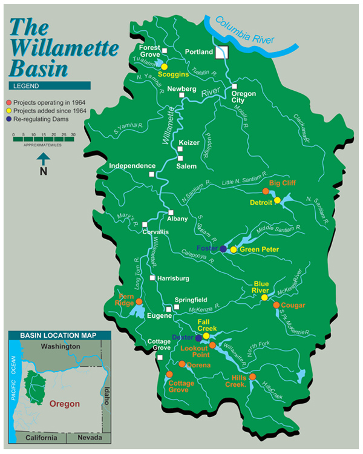

## Overview {.tabset .tabset-pills}

**An engaging image**
(with caption, incl. photo credit) that is relevant to the dataset



**Report Summary EDIT** 
This report explores adult fish passage of coho, jack coho and steelhead salmon recorded from January 2001 to December 2010 at the Willamette Falls fish ladder on the Willamette River (Oregon). This document consists of 3 tabs: a time series, a seasonplot, and annual counts by species. This data was recorded by and made accessible through the Columbia River DART project. Fish counting through Willamette Falls fishway was recorded using video cameras and time lapsed video recorders to record fish passage 24 hrs/day, 365 days/year.

**A map of the fish ladder location**
(you can make this in R on your own, or include an existing map appropriately licensed, with attribution)


**Data Citation**
Data source: Columbia River DART (Data Access in Real Time), 2010. Data Courtesy of U.S. Army Corps of Engineers, NWD and Chelan, Douglas, and Grant County PUDs, Yakima Klickitat Fisheries Project, Colville Tribes Fish & Wildlife (OBMEP), Oregon Department of Fish & Wildlife, Washington Department of Fish & Wildlife.


```{r setup, include= TRUE, warning = FALSE, message= FALSE}
knitr::opts_chunk$set(echo = TRUE, warning = FALSE, message = FALSE)
library(tidyverse)
library(here)
library(broom)
library(lubridate)
library(ggpubr)

# Time series packages
library(tsibble)
library(feasts)
library(fable)

## reading in the data and cleaning up
will <- read_csv(here::here("data", "willamette.csv")) %>% 
  janitor::clean_names()
## counting by species for furture tabs
will_count <- will %>% 
  select(c("coho", "jack_coho", "steelhead", "date")) %>% 
  replace(is.na(.), 0) %>% 
  mutate(date2 = lubridate::mdy(date)) %>% 
  group_by(date2,  steelhead, coho, jack_coho) %>% 
  summarize(total_count = sum(steelhead, coho, jack_coho))
```

### Original time series data

#### **Objective**

Below we present a static graph displaying adult passage for coho, jack coho, and steelhead salmon separately. This figure allows us to analyze yearly population trends in these three species and gives us a good baseline understanding of how these populations have changed over the study period. 
```{r, fig.cap= "**Figure 1:** *Total Counts of Steelhead Salmon, Coho, and Jack Coho recorded from 2001-2010 at the Willamette River Basin, Oregon*"}
## subset the data for this chart

## want data just for coho, jack coho and salmon, 
will_static <- will %>% 
  select(c("coho", "jack_coho", "steelhead", "date")) 
## then  converting all NAs to zeros
will_static[is.na(will_static)] <- 0
#class(will_static$date)

# Currently R understands date variable as a character, need convert it into a time series data frame (a *tsibble*)
# 1. Add a new column (date) that is the current month column converted to a time series class, yearmonth
# 2. Convert the data frame to a tsibble, with that date column as the time index
will_ts <- will_static %>% 
  mutate(date2 = lubridate::mdy(date)) %>% 
  as_tsibble(key = NULL, index = date2) ## tells it to treat the data as a time series tibble  

## first graph of all three on one
# ggplot(data = will_ts, aes(x = date2)) +
#   geom_line(aes(y =steelhead), color = "green") +
#   geom_line(aes(y = jack_coho), color = "red") +
#   geom_line(aes(y = coho), color = "blue") +
#   theme_minimal() +
#   scale_color_viridis_c() +
#   labs()

## now going to plot all separately and put together using ggarrange
steel_ts <- ggplot(data = will_ts, aes(x = date2)) +
  geom_line(aes(y =steelhead), color = "blue")+
  labs(y= "Count", subtitle = "Steelhead Salmon",
       x = "")+
  theme_minimal()

coho_ts <- ggplot(data = will_ts, aes(x = date2)) +
  geom_line(aes(y =coho), color = "red")+
  labs(y= "Count", subtitle = "Coho", x = "") +
  theme_minimal()

jack_ts <- ggplot(data = will_ts, aes(x = date2)) +
  geom_line(aes(y =jack_coho), color = "green") +
  labs(y= "Count", subtitle = "Jack Coho", x = "")+
  theme_minimal()

ggarrange(steel_ts, coho_ts, jack_ts, nrow = 3)

```

#### **Time Series Plot Takeaways EDIT**

- Steelhead are by far the most abundant fish in the Willamette River, or they are just better at accessing the fish ladder. Steelhead have seasonality of when they pass through the fish ladder, but some years have larger counts than others.There is no apparent trend in Steelhead counts as it varies year to year.

- Both Coho and Jack Coho counts do not have the same seasonality that Steelhead have. Their counts are relatively low and there is a lack of an overall trend. It seems, though, that as more data gets collected, we may see some seasonality with their counts.


### Seasonplots

#### **Objective**

A finalized seasonplot for each species (coho, jack coho, steelhead) in its own panel. You can either facet_wrap/facet_grid, or use patchwork or cowplot, to make the figure. Add a caption.

```{r, fig.cap= "**Figure 2:** *Seasonplots of Steelhead Salmon, Coho, and Jack Coho recorded from 2001-2010 at the Willamette River Basin, Oregon*"}
# steel_seas <- will_ts %>% 
#   gg_season(y = steelhead) + ## using ggseason function
#   theme_minimal() +
#   scale_color_viridis_c() +
#   labs(x = "",
#        y = "Count")
# 
# coho_seas <-will_ts %>% 
#   gg_season(y = coho) + ## using ggseason function
#   theme_minimal() +
#   scale_color_viridis_c() +
#   labs(x = "",
#        y = "coho")
# 
# jack_seas <-will_ts %>% 
#   gg_season(y = jack_coho) + ## using ggseason function
#   theme_minimal() +
#   scale_color_viridis_c() +
#   labs(x = "",
#        y = "Jack Coho")
# 
# ggarrange(steel_seas, coho_seas, jack_seas, nrow = 3)

## wrangling data for seasonplots
will_seas <- will_count %>% 
  as_tsibble(key = NULL, index = date2) %>% 
  pivot_longer("steelhead":"jack_coho",
               names_to = "species",
               values_to = "value") %>% 
  mutate(species = 
         ifelse(species == "steelhead", "Steelhead Salmon",
         ifelse(species == "coho", "Coho", 
         ifelse(species == "jack_coho", "Jack Coho", 
                "" )))) %>% 
  select(-total_count) %>% 
  rename(total_count = value)
  

all_seasonplot <- will_seas %>% 
  gg_season(y = total_count) +
  labs(x = "Date", y = "Count", title = "Total Counts of Coho, Jack Coho, and Steelhead Salmon",
       subtitle = "Data collected at Willamette Falls River Basin from 2001-2010") +
  theme_minimal()
all_seasonplot
```

#### **Season Plot Takeaways EDIT**

- Observed seasonal patterns can be seen across all three species. Coho and jack coho have similar seasonal passage of the falls, whereas steelhead have a longer, more sustained seasonal passage.

- Coho and jack coho have similar seasonal patterns with a serge occurring between late September and early October. Coho appear to have an increase in number of fish passing through in 2009 and 2010. Jack coho had a their highest count in 2008.

- Steelhead trout pass through the falls over a much longer, sustained period between January through July. There is a slight rise in counts in May and June every year and then much less after July and August. In general, there are more steelhead passing through the falls each year than coho and jack coho.

### Annual counts by species

#### **Objective**

Below we visualize the total counts of Coho, Jack Coho, and Steelhead Salmon from the 
A finalized figure of annual totals for fish passage, for each of the 3 species (coho, jack coho, steelhead). 
```{r, fig.cap= "**Figure 3:** *Graph of Steelhead Salmon, Coho, and Jack Coho total recorded populations by year from 2001-2010*"}
## first need to group the observations by species, extract year from the date column and then sum the species by year
will_count_yearly <- will_count %>% 
  pivot_longer("steelhead":"jack_coho",
               names_to = "Species",
               values_to = "value") %>%
  mutate(Species = 
         ifelse(Species == "steelhead", "Steelhead Salmon",
         ifelse(Species == "coho", "Coho", 
         ifelse(Species == "jack_coho", "Jack Coho", 
                "" )))) %>% 
  mutate(year = as.Date(as.character(date2),format = "%Y")) %>%
  group_by(year, Species) %>% 
  summarize(annual_total = sum(value))

### now plotting all on same graph
will_count_yearly %>% 
  ggplot(aes(x = year, y = annual_total)) +
  geom_line(aes(color= Species)) +
  theme_minimal() +
  scale_x_date(date_labels = "%Y") +
  labs(
    x = "Year",
    y = "Count"
  )
```


#### **Annual Count Takeaways EDIT**

- Steelhead observations appear to be most volatile over time with large spikes in passage over the first 5 years eventual stabilization from 2005 to 2009 followed by a large population spike.

- Jack coho’s population remains relatively low and stable over time, seeing a small peak in population in 2008.

- Coho population has mild volatile over the first 8 years followed by a spike in population grow after 2008.

