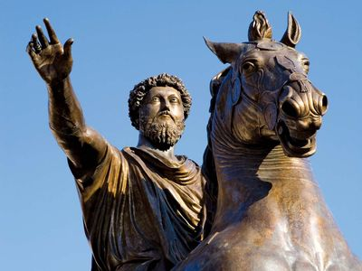

# Overview {.tabset .tabset-pills}

###Summary



This report presents textual vizualizations and sentiment analysis of the famous 'Meditations" by the philosopher king of Rome Marcus Aurelius. The report is split into three sections. In the first section I clean the data, put it into tidy, and remove all material other then the 3 books so that their content can be analyzed. In the second section I present two visualizations of the most common words by book number. Finally, the third section presents a sentiment analysis to determine how the sentiment differs across books using the XXXXXXXXXXXXXXXXX lexicon.

### Data Citation
Aurelius, M. (2003). The Meditations: A New Translation. Random House.


## Data Cleaning

In this section I convert the pdf text into a dataframe and then use the tidyverse to wrangle the data to prepare it for future analysis. 
```{r setup, include= TRUE, warning = FALSE, message= FALSE}
knitr::opts_chunk$set(echo = TRUE, warning = FALSE, message = FALSE)
library(tidyverse)
library(tidytext)
library(textdata)
library(pdftools)
library(ggwordcloud)

## Reading in the data- Meditations by Marcus Aurelius
meditations_text <- pdf_text(here::here('data', 'meditations.pdf'))
```

```{r}
#converting into a data frame,  wrangling with the tidyverse, 
med_lines <- data.frame(meditations_text) %>% ## convert to data frame
  mutate(page = 1:n()) %>%
  mutate(text_full = str_split(meditations_text, pattern = '\\n')) %>% 
  unnest(text_full) %>% 
  mutate(text_full = str_trim(text_full)) 


# Break it up by chapter, and do some analyses. 
# Adding a new column that contains the Book number (so we can use this as a grouping variable later on).
# Using `str_detect()` to look for any cells in "text_full" column that contains the string "Book", and if it does, the new column will contain that book number:
med_books <- med_lines %>% 
  slice(-(1:1432)) %>% # cutting out all intro stuff to just analyze Marcus Aurelius's portion of the writing
  mutate(book = ifelse(str_detect(text_full, "Book"), text_full, NA)) %>%  
  fill(book, .direction = 'down') %>% ## fills the NAs in chapter with the values above
  separate(col = book, into = c("bo", "no"), sep = " ") %>% # tells it to break apart the book column into two columns as specified and to separate by a space
  mutate(book = as.numeric(as.roman(no))) 
## Noticed note section at end still attached want to remove so can just analyze by book
med_books_clean <- med_books %>% 
  slice(-(3795:4393))
# tail(med_books_clean)


## Now removing stop words using `tidyr::anti_join()`, which will *omit* any words in `stop_words` from `hobbit_tokens`.
med_words <- med_books_clean %>% 
  unnest_tokens(word, text_full) %>% 
  select(-meditations_text)

med_words_clean <- med_words %>% 
  anti_join(stop_words, by = 'word') # tells it to remove words from the hobbit_words data frame looking specifically in the word column and filtering out words that match with the stop_words

## can do quick word count by book
med_counts <- med_words_clean %>% 
  count(book, word)
```


## Word Counts and WordClouds of Books 1-3
```{r}
## Looking at top 5 words
top_5_words <- med_counts %>% 
  group_by(book) %>% 
  arrange(-n) %>% 
  slice(1:5) %>%
  ungroup()

# Graph of most common 5 words from each chapter
ggplot(data = top_5_words, aes(x = n, y = word)) +
  geom_col(fill = "blue") +
  facet_wrap(~book, scales = "free")

## also going to make a wordcloud
# ch1_top100 <- nonstop_counts %>% 
#   filter(chapter == 1) %>% 
#   arrange(-n) %>%  ## tells it to arrange from highest to lowest of n
#   slice(1:100) # then tells it to just take the top 100 rows
# 
# ch1_cloud <- ggplot(data = ch1_top100, aes(label = word)) +
#   geom_text_wordcloud(aes(color = n, size = n), shape = "diamond") +
#   scale_size_area(max_size = 6) +
#   scale_color_gradientn(colors = c("darkgreen","blue","purple")) +
#   theme_minimal()
# 
# ch1_cloud
```


## Sentiment analysis of 'The Meditations'
```{r}

```

